Manual de usuario
=================

Unha vez instalado o plugin engadirase unha nova entrada no menú Web e tres novas
accións na barra de ferramentas:

|imageAdd|
    Mostra o diálogo para conectar con un servidor SOS e engadir unha
    capa de observacións.

|imageXML|
    Visualiza o ficheiro XML usado para xerar a capa activa.

|imagePlot|
    Xera unha gráfica coas observacións correspondentes ás entidades
    seleccionadas na capa activa.

Crear capa de observacións
--------------------------

Ó pulsar a acción |imageAdd| mostrarase o formulario seguinte:

|fig:tabInfo-limpia| Diálogo de conexión co servidor, sen datos.

Neste formulario pódese xestionar a lista de servidores cos botóns Novo,
Editar e Eliminar, e co botón Conectar visualizar as capacidades do
servidor seleccionado.

Unha vez se conectou con un servidor móstranse as súas capacidades na
lapela Información:

|fig:tabInfo| Diálogo de conexión co servidor, con datos

Para obter as observacións débese seleccionar unha oferta no campo
Ofertas e pódese modificar no Nome da capa. Tamén se poden indicar os datos que correspondan nas lapelas dispoñibles:

|fig:tabPropiedades|
Lista de propiedades da oferta. Pode seleccionar unha ou varias.

|fig:tabEntidades|
Lista de entidades da oferta. Pode seleccionar varias ou ningunha.

|fig:tabProcedementos|
Lista de procedementos. Pode seleccionar varios ou ningún.

|fig:tabFiltros|
Filtros dispoñibles. Pódense activar varios ó mesmo tempo. No caso
do espacial, pulsando na icona poderase seleccionar a xeometría a
consultar debuxando no mapa. |fig:spatialtool|

|fig:tabResultado|
Pódese seleccionar o modelo de resultado entre os dispoñibles para
o servidor. Permite indicar se todas as entidades terán información
xeométrica ou so a primeira para cada *foi* e seleccionar se engadir a
capa ó TimeManager. Tamén se pode seleccionar o directorio de traballo
no que se gardan os datos descargados.

Unha vez seleccionadas as opcións desexadas pódese engadir a capa ó QGIS
pulsando no botón Engadir, ou cambiar o XML a enviar antes de engadir a
capa co botón ’Editar petición’.

|fig:editarPeticion| Engadir capa SOS

Gráficos en dúas dimensións
---------------------------

Para visualizar un gráfico é necesario que a capa activa teña unha ou
máis entidades seleccionadas, e despois premer no botón |imagePlot|.

|fig:ejecutarSOSPlot| Executar ferramenta SOS Plot

Esta operación abrirá unha nova ventá (figura [fig:sosplot]) na que se
visualizará a gráfica, e na que se poden editar as opcións do mesmo e
interactuar coa gráfica.

|fig:sosplot| SOS Plot: Gráfica de varias series

Neste formulario pódese editar o título do gráfico e dos eixos, a
propiedade a representar en cada eixo e os límites dos mesmos, o formato
no que representar o tempo, a inclusión dunha lenda, e o estilo e cor de
liña e marcador de cada unha das series debuxadas. Amais sobre a gráfica
pódese facer zoom, desprazala e gardar a imaxe.

.. |imageAdd| image:: _static/icon_add.png
.. |imageXML| image:: _static/icon_xml.png
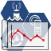
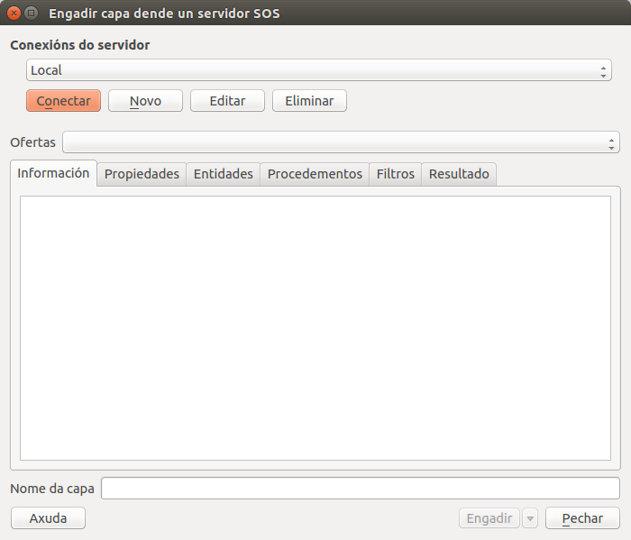
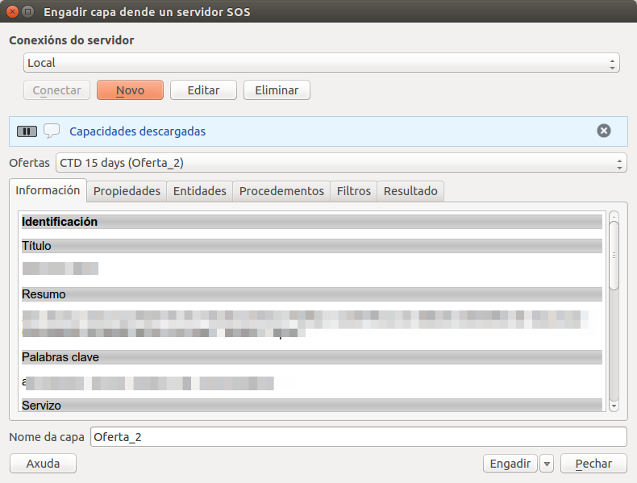
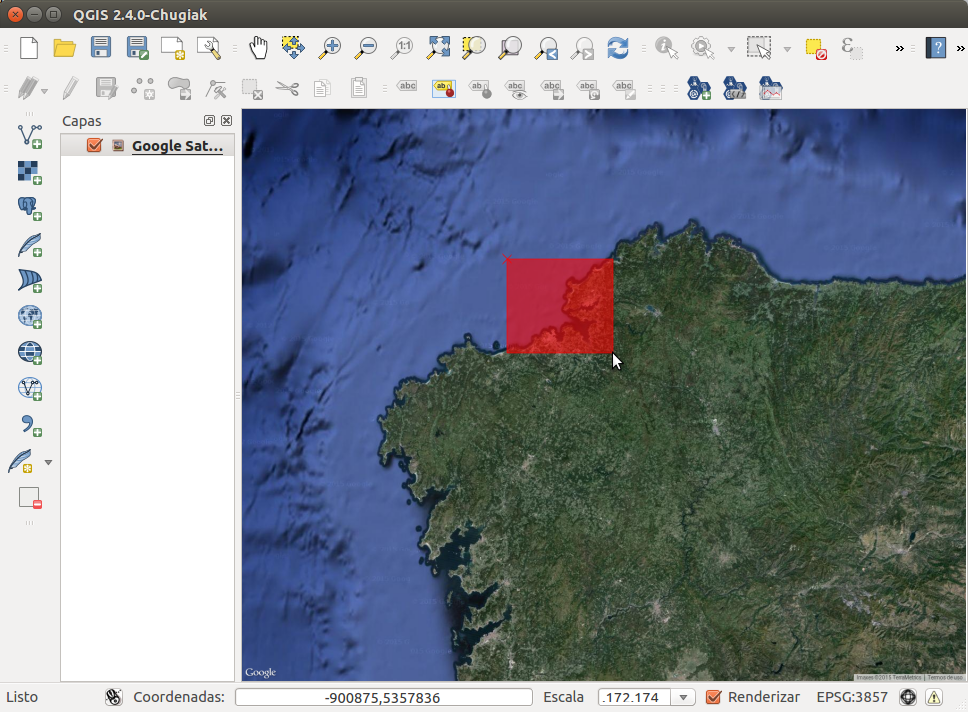
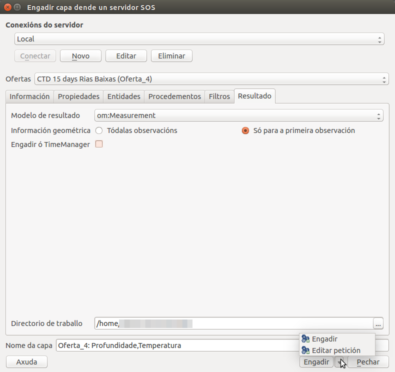
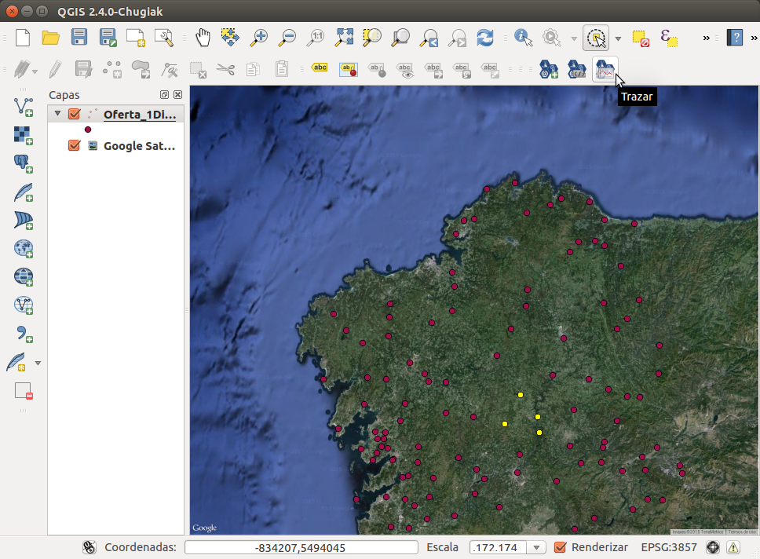
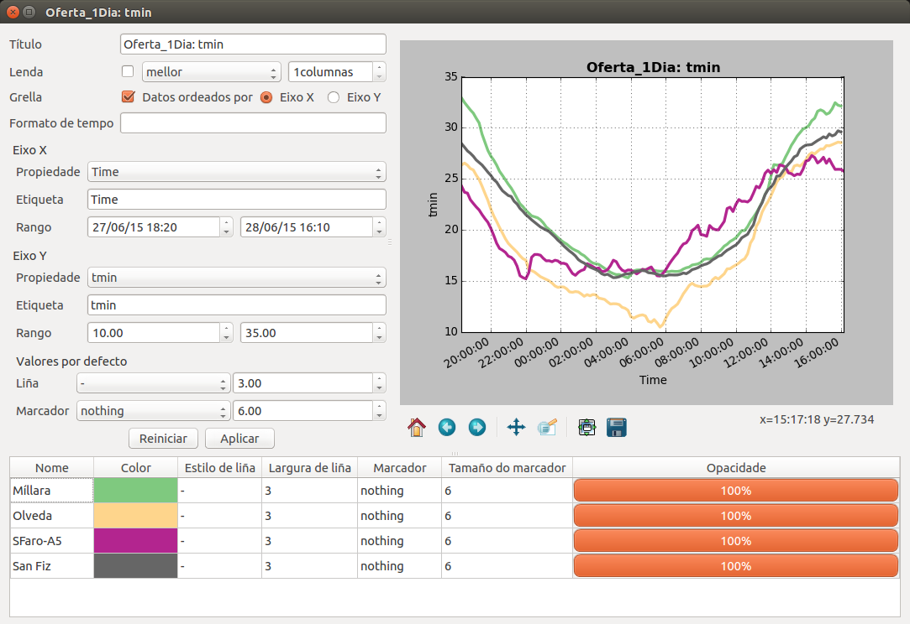
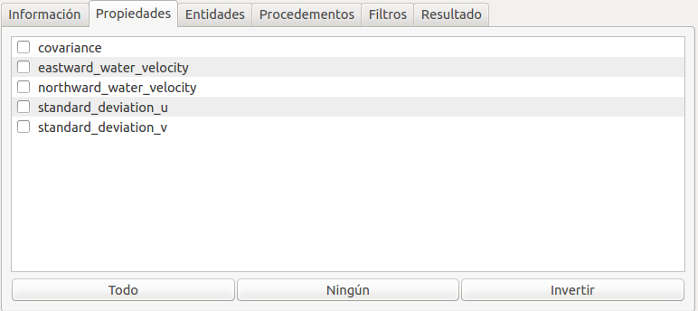
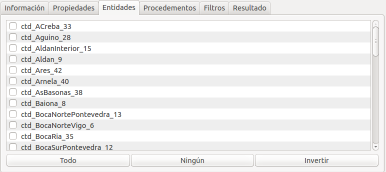
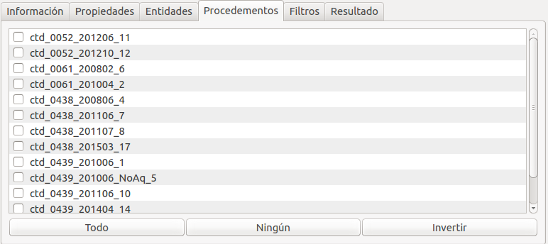
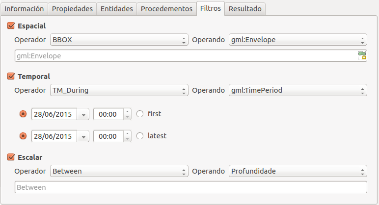
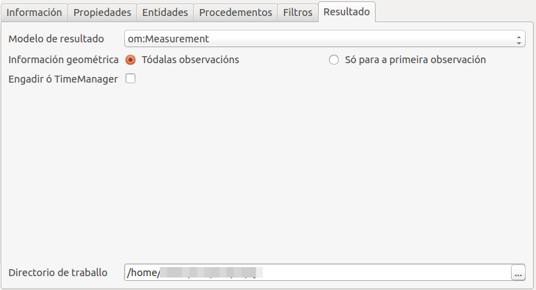
